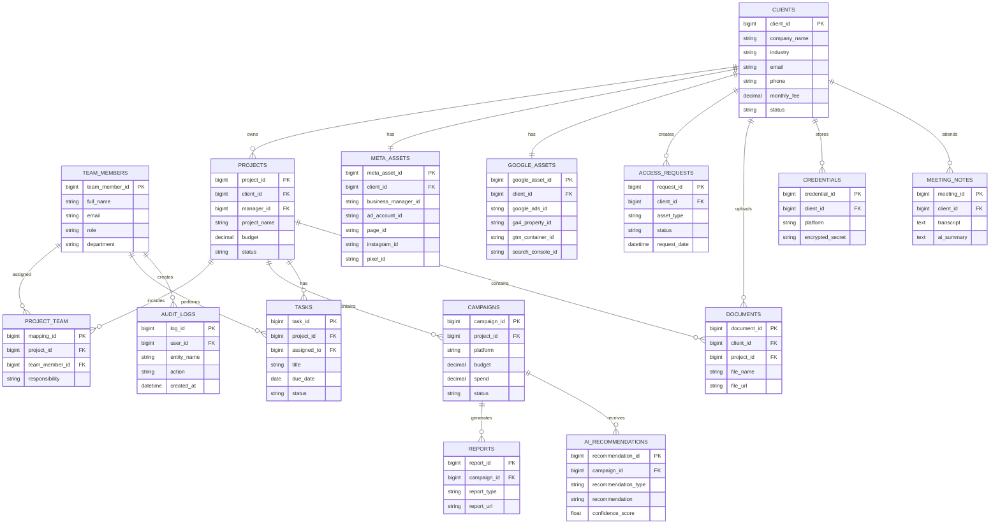

# AI-Powered-Marketing-Agency-Management-System-technical-solution

This document presents a comprehensive technical solution for a marketing agency management system designed to handle 100+ clients with scalability to 1,000+. The architecture leverages modern cloud technologies, AI integration, and robust security practices to create an efficient, scalable platform.

# Recommended Spring Boot Stack

Spring Boot 3.x (with Java 17+)

Spring Data JPA + PostgreSQL/MYSQL

Spring Security + OAuth2 Resource Server

Spring Cache + Redis

Spring Cloud (if microservices – Feign, Circuit Breaker, Config Server)

Spring Batch for heavy data processing

Spring AI (for LLM integrations)

Liquibase for DB migrations

MapStruct for DTO mapping

Lombok for boilerplate reduction

Micrometer + Prometheus + Grafana for monitoring

# 1. System Architecture Diagram

#2. Database Design

# SQL queries with explanations
# 1. Pending Meta Access Requests

SELECT                           
    ar.request_id,            
    c.company_name,          
    ar.asset_type,          
    ar.request_date,          
    ar.status          
FROM AccessRequests ar          
JOIN Clients c          
    ON ar.client_id = c.client_id          
WHERE ar.asset_type = 'META'          
  AND ar.status = 'PENDING'          
ORDER BY ar.request_date ASC;          

Explanation
          
Retrieves all pending Meta Business access requests.          
Joins the Clients table to display the client name.          
Oldest requests appear first so the team can prioritize them.          

# 2. Overdue Campaigns

SELECT    
    campaign_id,    
    campaign_name,    
    end_date,    
    status    
FROM Campaigns    
WHERE end_date < CURRENT_DATE    
AND status <> 'COMPLETED';    

Explanation  
Finds campaigns whose end date has already passed.  
Ignores completed campaigns. 
Useful for dashboard alerts. 

# 3. Team Workload

SELECT  
    tm.team_member_id, 
    tm.full_name, 
    COUNT(t.task_id) AS total_tasks 
FROM TeamMembers tm 
LEFT JOIN Tasks t 
ON tm.team_member_id = t.assigned_to 
AND t.status <> 'COMPLETED' 
GROUP BY tm.team_member_id, tm.full_name 
ORDER BY total_tasks DESC; 

Explanation  
Counts active tasks for each employee. 
Helps managers distribute work evenly. 

# 4. Clients Missing GA4 or GTM

SELECT    
    c.client_id, 
    c.company_name 
FROM Clients c 
LEFT JOIN GoogleAssets g 
ON c.client_id = g.client_id 
WHERE g.ga4_property_id IS NULL 
   OR g.gtm_container_id IS NULL; 

   Explanation   
Finds clients who have not completed Google Analytics or Google Tag Manager setup. 
Useful during onboarding.
 

# 5. Monthly Revenue

SELECT    
    YEAR(contract_start) AS year, 
    MONTH(contract_start) AS month, 
    SUM(monthly_fee) AS total_revenue 
FROM Clients 
WHERE status = 'ACTIVE' 
GROUP BY YEAR(contract_start), 
         MONTH(contract_start) 
ORDER BY year DESC, 
         month DESC; 

 Explanation   
Calculates agency revenue based on client retainers. 
Groups revenue by month

# 6. Inactive Clients  

SELECT    
    client_id, 
    company_name, 
    status 
FROM Clients 
WHERE status = 'INACTIVE'; 

Explanation   
Lists all inactive clients. 
Useful for retention campaigns. 

# 7. Highest Spend Campaigns

SELECT    
    campaign_id,  
    campaign_name, 
    platform, 
    spend 
FROM Campaigns 
ORDER BY spend DESC 
LIMIT 10;  

Explanation  
Returns the Top 10 campaigns by advertising spend.  
Helps identify major campaigns.

# 8. Total Campaign Spend per Client

SELECT    
    c.company_name,  
    SUM(cp.spend) AS total_spend   
FROM Clients c  
JOIN Projects p  
ON c.client_id = p.client_id  
JOIN Campaigns cp  
ON p.project_id = cp.project_id  
GROUP BY c.company_name  
ORDER BY total_spend DESC;  

Explanation  
Calculates total advertising spend for each client. 
Useful for client reports.

 # 9. Campaign Performance

 SELECT    
    campaign_name,  
    impressions, 
    clicks, 
    conversions, 
    spend 
FROM Campaigns 
ORDER BY conversions DESC; 

Explanation  
Shows campaign performance metrics.  
Can be used for dashboard analytics. 
 
# 10. Pending Tasks

SELECT   
    task_id,  
    title, 
    due_date, 
    status 
FROM Tasks 
WHERE status = 'PENDING' 
ORDER BY due_date; 
ExplanationC
Displays pending tasks ordered by due date. 
Helps marketing executives prioritize work.

# API Design

# Client Management
GET /api/v1/clients               
GET /api/v1/clients/{id}  
POST /api/v1/clients  
PUT /api/v1/clients/{id}  
DELETE /api/v1/clients/{id}  
GET /api/v1/clients/{id}/campaigns  

# Campaign Management
GET /api/v1/campaigns    
GET /api/v1/campaigns/{id}  
POST /api/v1/campaigns  
PUT /api/v1/campaigns/{id}  
PATCH /api/v1/campaigns/{id}/status  
POST /api/v1/campaigns/{id}/launch  
DELETE /api/v1/campaigns/{id}  

# Asset Management
GET /api/v1/assets/meta  
GET /api/v1/assets/google  
POST /api/v1/assets/meta  
POST /api/v1/assets/google  
GET /api/v1/assets/meta/{id}/performance  

# Reporting
GET /api/v1/reports  
POST /api/v1/reports/generate  
GET /api/v1/reports/{id}  
GET /api/v1/reports/{id}/download  
GET /api/v1/dashboard/ceo  
GET /api/v1/dashboard/manager  
GET /api/v1/dashboard/executive  

# Analytics
GET /api/v1/analytics/campaign/{id}/metrics  
GET /api/v1/analytics/roi  
GET /api/v1/analytics/forecast  
POST /api/v1/analytics/optimization-suggestions  

# AI Integration
POST /api/v1/ai/summarize  
POST /api/v1/ai/generate-report  
POST /api/v1/ai/optimization  
POST /api/v1/ai/ad-copy  
POST /api/v1/ai/analyze-performance  

