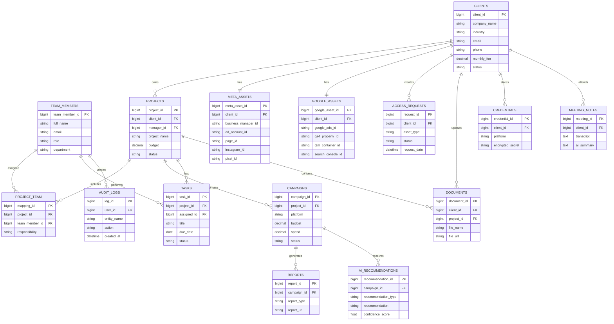

# AI-Powered-Marketing-Agency-Management-System-technical-solution

This document presents a comprehensive technical solution for a marketing agency management system designed to handle 100+ clients with scalability to 1,000+. The architecture leverages modern cloud technologies, AI integration, and robust security practices to create an efficient, scalable platform.

# Recommended Spring Boot Stack

Spring Boot 3.x (with Java 17+)

Spring Data JPA + PostgreSQL/MYSQL

Spring Security + OAuth2 Resource Server

Spring Cache + Redis

Spring Cloud (if microservices – Feign, Circuit Breaker, Config Server)

Spring Batch for heavy data processing

Spring AI (for LLM integrations)

Liquibase for DB migrations

MapStruct for DTO mapping

Lombok for boilerplate reduction

Micrometer + Prometheus + Grafana for monitoring

# 1. System Architecture Diagram

# 2. Database Design

# SQL queries with explanations
# 1. Pending Meta Access Requests

SELECT                           
    ar.request_id,            
    c.company_name,          
    ar.asset_type,          
    ar.request_date,          
    ar.status          
FROM AccessRequests ar          
JOIN Clients c          
    ON ar.client_id = c.client_id          
WHERE ar.asset_type = 'META'          
  AND ar.status = 'PENDING'          
ORDER BY ar.request_date ASC;          

Explanation
          
Retrieves all pending Meta Business access requests.          
Joins the Clients table to display the client name.          
Oldest requests appear first so the team can prioritize them.          

# 2. Overdue Campaigns

SELECT    
    campaign_id,    
    campaign_name,    
    end_date,    
    status    
FROM Campaigns    
WHERE end_date < CURRENT_DATE    
AND status <> 'COMPLETED';    

Explanation  
Finds campaigns whose end date has already passed.  
Ignores completed campaigns. 
Useful for dashboard alerts. 

# 3. Team Workload

SELECT  
    tm.team_member_id, 
    tm.full_name, 
    COUNT(t.task_id) AS total_tasks 
FROM TeamMembers tm 
LEFT JOIN Tasks t 
ON tm.team_member_id = t.assigned_to 
AND t.status <> 'COMPLETED' 
GROUP BY tm.team_member_id, tm.full_name 
ORDER BY total_tasks DESC; 

Explanation  
Counts active tasks for each employee. 
Helps managers distribute work evenly. 

# 4. Clients Missing GA4 or GTM

SELECT    
    c.client_id, 
    c.company_name 
FROM Clients c 
LEFT JOIN GoogleAssets g 
ON c.client_id = g.client_id 
WHERE g.ga4_property_id IS NULL 
   OR g.gtm_container_id IS NULL; 

   Explanation   
Finds clients who have not completed Google Analytics or Google Tag Manager setup. 
Useful during onboarding.
 

# 5. Monthly Revenue

SELECT    
    YEAR(contract_start) AS year, 
    MONTH(contract_start) AS month, 
    SUM(monthly_fee) AS total_revenue 
FROM Clients 
WHERE status = 'ACTIVE' 
GROUP BY YEAR(contract_start), 
         MONTH(contract_start) 
ORDER BY year DESC, 
         month DESC; 

 Explanation   
Calculates agency revenue based on client retainers. 
Groups revenue by month

# 6. Inactive Clients  

SELECT    
    client_id, 
    company_name, 
    status 
FROM Clients 
WHERE status = 'INACTIVE'; 

Explanation   
Lists all inactive clients. 
Useful for retention campaigns. 

# 7. Highest Spend Campaigns

SELECT    
    campaign_id,  
    campaign_name, 
    platform, 
    spend 
FROM Campaigns 
ORDER BY spend DESC 
LIMIT 10;  

Explanation  
Returns the Top 10 campaigns by advertising spend.  
Helps identify major campaigns.

# 8. Total Campaign Spend per Client

SELECT    
    c.company_name,  
    SUM(cp.spend) AS total_spend   
FROM Clients c  
JOIN Projects p  
ON c.client_id = p.client_id  
JOIN Campaigns cp  
ON p.project_id = cp.project_id  
GROUP BY c.company_name  
ORDER BY total_spend DESC;  

Explanation  
Calculates total advertising spend for each client. 
Useful for client reports.

 # 9. Campaign Performance

 SELECT    
    campaign_name,  
    impressions, 
    clicks, 
    conversions, 
    spend 
FROM Campaigns 
ORDER BY conversions DESC; 

Explanation  
Shows campaign performance metrics.  
Can be used for dashboard analytics. 
 
# 10. Pending Tasks

SELECT   
    task_id,  
    title, 
    due_date, 
    status 
FROM Tasks 
WHERE status = 'PENDING' 
ORDER BY due_date; 
ExplanationC
Displays pending tasks ordered by due date. 
Helps marketing executives prioritize work.

#  Dashboards

Dashboards are built as React frontends consuming REST APIs from Spring Boot.

 # 1.CEO
 KPIs - Total revenue (trend), active client count, client churn, new clients, average revenue per client, team utilisation, top 5 campaigns, client satisfaction score

 # 2.Account Manager
 KPIs -  Portfolio size, revenue per client, client health scores, upcoming deliverables, pending approvals, task completion rate, meeting schedule

 # 3.Marketing Executive
 KPIs  -  Active campaigns, pending launches, daily spend, CPA trends, top creative performance, A/B test results, optimisation suggestions, daily checklist
 

# API Design

# Client Management
GET /api/v1/clients               
GET /api/v1/clients/{id}  
POST /api/v1/clients  
PUT /api/v1/clients/{id}  
DELETE /api/v1/clients/{id}  
GET /api/v1/clients/{id}/campaigns  

# Campaign Management
GET /api/v1/campaigns    
GET /api/v1/campaigns/{id}  
POST /api/v1/campaigns  
PUT /api/v1/campaigns/{id}  
PATCH /api/v1/campaigns/{id}/status  
POST /api/v1/campaigns/{id}/launch  
DELETE /api/v1/campaigns/{id}  

# Asset Management
GET /api/v1/assets/meta  
GET /api/v1/assets/google  
POST /api/v1/assets/meta  
POST /api/v1/assets/google  
GET /api/v1/assets/meta/{id}/performance  

# Reporting
GET /api/v1/reports  
POST /api/v1/reports/generate  
GET /api/v1/reports/{id}  
GET /api/v1/reports/{id}/download  
GET /api/v1/dashboard/ceo  
GET /api/v1/dashboard/manager  
GET /api/v1/dashboard/executive  

# Analytics
GET /api/v1/analytics/campaign/{id}/metrics  
GET /api/v1/analytics/roi  
GET /api/v1/analytics/forecast  
POST /api/v1/analytics/optimization-suggestions  

# AI Integration
POST /api/v1/ai/summarize  
POST /api/v1/ai/generate-report  
POST /api/v1/ai/optimization  
POST /api/v1/ai/ad-copy  
POST /api/v1/ai/analyze-performance  

Authentication & Authorisation: OAuth2 + JWT, with @PreAuthorize on methods.   
Validation: @Valid with Bean Validation 2.0.   
Logging: MDC for request tracing; JSON logs to ELK.    
Rate Limiting: Resilience4j RateLimiter filter backed by Redis.  
Error Handling: Global @ControllerAdvice returning standardised error responses.  

# AI Integration

 
We leverage Spring AI to unify access to LLMs (OpenAI, Anthropic, Azure) and embedding models.  

Use Cases:   

Meeting Summarisation – call ChatClient with a prompt to extract action items and decisions.  

Report Generation – combine performance data with natural language insights; prompt includes data as JSON.  

Optimisation Recommendations – feed campaign metrics and ask for bid adjustments, audience refinements, etc.  

Ad Copy Creation – use PromptTemplate with product/audience variables to generate variations.
 
Campaign Performance Analysis – detect trends, anomalies, and benchmarks automatically.
 
All AI calls are asynchronous for long‑running tasks, with retry and fallback strategies.
 

# MCP (Model Context Protocol)

MCP is a protocol that standardises how AI assistants request and receive structured context from external systems. Unlike REST, which is resource‑oriented, MCP is query‑driven and returns data that an LLM can directly consume, often with metadata and tool definitions. 

# MCP vs REST

Aspect	REST API	MCP
Purpose	CRUD operations, frontend data	Context provisioning for AI models
Endpoint design	Multiple resources with standard verbs	Single /context endpoint with dynamic intent parsing
Request format	Path/query parameters + body	Natural language query + optional filters
Response format	Entity DTOs	Structured context (JSON with LLM‑friendly schema)
Security	OAuth2 scopes, RBAC	Same, plus client‑scope filtering
Use cases	UI interactions, integrations	AI agents, RAG, automated insights

# Secure AI Assistant Query Flow (MCP Implementation in Spring)

 * AI Assistant (our internal agent or third‑party) sends a POST /mcp/v1/context request with a JWT token and a natural language query.  

* MCP Controller validates the JWT using Spring Security OAuth2.  

* The IntentParser (powered by a lightweight LLM) extracts the required data types (e.g., campaign performance, client list) and any filters (client name, date range).  

* Permission enforcement: AuthorizationService ensures the user has access to the requested clients (based on RBAC and client‑scope claims). If not, 403 is returned. 

* Data retrieval: Service layer fetches data from PostgreSQL (with RLS) and Redis cache. 

* Context builder formats the data into a standardised MCP JSON structure (includes metadata like source, timestamp). 

* Audit logging: asynchronously logs the request (user, query, data accessed). 

* Response is sent back to the AI Assistant, which then synthesises a natural language answer for the user. 

All communication is over TLS 1.3, and rate limiting is applied to prevent abuse. 

 #  RAG (Retrieval‑Augmented Generation)
 
We implement a RAG pipeline using Spring AI and Pinecone (or Redis Stack) as vector store .  

# Architecture 

Document Ingestion:   

Load SOPs, marketing docs, client briefs from S3.    

Chunk using TokenTextSplitter (chunk size 500 tokens, overlap 20%).   

Embed with OpenAiEmbeddingModel (or local model).  

Store vectors + metadata (document type, version, client‑scope) in Pinecone.  

Query Pipeline:  

User question → embed → similarity search (top‑k=5).  

Retrieve chunks and filter by user’s client scope (metadata filter).   

Build prompt: "Context: ...\nQuestion: ..."    

Call LLM to generate answer with citations.  

Chunking Strategy: Semantic chunking based on headings and paragraphs; overlapping to preserve context across boundaries.  

Vector Database: Pinecone (managed, scalable) with index optimised for cosine similarity.  

#  Automation

We use a combination of Spring Integration (for core workflows) and n8n (for non‑critical automations). 

Core Automations (implemented in Spring):  

Campaign Launch: When campaign status changes to APPROVED, a Spring Integration flow pushes to Meta/Google, monitors launch, updates status, and sends notifications.  

Performance Alerts: Scheduled job (every hour) checks ROAS/CPA thresholds; if breached, send Slack/email alerts.  

Weekly Report Generation: Spring Batch job aggregates performance data, generates PDF, uploads to S3, and emails stakeholders.  

Access Request Approval: State machine handles approval workflow with email notifications.  

External Automations (via n8n webhooks):  

Client onboarding: Send welcome emails, create Slack channels, schedule meetings. 

Document management: Sync to Google Drive when new documents are uploaded. 

Social media posting: Automate sharing of case studies.  

All automations are event‑driven using Spring Cloud Stream with Kafka, ensuring decoupling and scalability.
 

#  Workflow Automation with n8n

Automation: Campaign Launch Workflow    
Triggers:  
  - Campaign status changes to 'approved'  
  - Time-based schedule  

Actions:   
  1. Validate campaign setup  
  2. Push to Meta/Google 
  3. Monitor launch status 
  4. Send notifications 
  5. Update internal systems 
  6. Generate initial report 

Workflow: 
  - HTTP Request: Check campaign readiness  
   - Switch: Platform (Meta/Google) 
  - HTTP Request: Create campaign 
  - Delay: Wait for approval 
  - IF: Launch successful 
    - Update database status 
    - Send email notification 
    - Generate first performance snapshot 
  - ELSE: 
    - Log error 
    - Send alert 
    - Update status to 'failed' 

# README

 # Assumptions 

Scale: Initial 100 clients, scalable to 1,000+    

Data Volume: Millions of performance records 

Users: 10-50 internal users, 100+ client users 

Compliance: GDPR, CCPA, industry standards 

Integration: Standard APIs for Meta, Google platforms  

Budget: Mid-market SaaS budget for infrastructure  

# Trade-offs 

Relational Database vs NoSQL: PostgreSQL for ACID, Redis for caching  

Monolith vs Microservices: Modular monolith initially, microservices later  

Cloud vs On-Premise: AWS/GCP for scalability and managed services  

Custom vs Off-the-Shelf: Custom solution for flexibility  

Performance vs Cost: Optimize for cost-performance balance  

# Future Improvements

Advanced AI: Custom fine-tuned models for marketing  

Real-time Processing: Streaming analytics with Kafka 

Predictive Analytics: ML models for forecasting  

Natural Language Interface: Full conversational agent  

Multi-tenancy: Enhanced isolation and white-labeling  

Automated Testing: Comprehensive test suite  

Disaster Recovery: Multi-region deployment  

Compliance Automation: Automated GDPR/CCPA tools  

