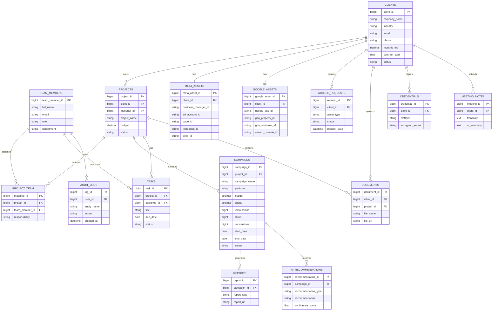

# AI-Powered Marketing Agency Management System — Technical Solution

This document presents a comprehensive technical solution for a marketing agency management system designed to handle 100+ clients with scalability to 1,000+. The architecture leverages modern cloud technologies, AI integration, and robust security practices to create an efficient, scalable platform.

---

## Recommended Spring Boot Stack

- Spring Boot 3.x (Java 17+)
- Spring Data JPA + PostgreSQL / MySQL
- Spring Security + OAuth2 Resource Server
- Spring Cache + Redis
- Spring Cloud (Feign, Circuit Breaker, Config Server) — for microservices phase
- Spring Batch — heavy data processing
- Spring AI — LLM integrations
- Liquibase — DB migrations
- MapStruct — DTO mapping
- Lombok — boilerplate reduction
- Micrometer + Prometheus + Grafana — monitoring

---

## 1. System Architecture Diagram


---

## 2. Database Design

> **Note:** Schema updated to include columns required by the reporting/dashboard queries in Section 3 (`campaign_name`, `end_date`, `impressions`, `clicks`, `conversions` on `CAMPAIGNS`; `contract_start` on `CLIENTS`). This keeps the ER model consistent with every query below.



---

## 3. SQL Queries with Explanations

*All queries below are verified against the schema above — every referenced column now exists in its source table.*

### 1. Pending Meta Access Requests
```sql
SELECT
    ar.request_id,
    c.company_name,
    ar.asset_type,
    ar.request_date,
    ar.status
FROM AccessRequests ar
JOIN Clients c
    ON ar.client_id = c.client_id
WHERE ar.asset_type = 'META'
  AND ar.status = 'PENDING'
ORDER BY ar.request_date ASC;
```
**Explanation:** Retrieves all pending Meta Business access requests, joined with `Clients` to show the company name. Oldest requests appear first so the team can prioritize them.

### 2. Overdue Campaigns
```sql
SELECT
    campaign_id,
    campaign_name,
    end_date,
    status
FROM Campaigns
WHERE end_date < CURRENT_DATE
  AND status <> 'COMPLETED';
```
**Explanation:** Finds campaigns whose end date has already passed but haven't been marked completed. Useful for dashboard alerts.

### 3. Team Workload
```sql
SELECT
    tm.team_member_id,
    tm.full_name,
    COUNT(t.task_id) AS total_tasks
FROM TeamMembers tm
LEFT JOIN Tasks t
    ON tm.team_member_id = t.assigned_to
   AND t.status <> 'COMPLETED'
GROUP BY tm.team_member_id, tm.full_name
ORDER BY total_tasks DESC;
```
**Explanation:** Counts active (non-completed) tasks per employee. Helps managers distribute work evenly.

### 4. Clients Missing GA4 or GTM Setup
```sql
SELECT
    c.client_id,
    c.company_name
FROM Clients c
LEFT JOIN GoogleAssets g
    ON c.client_id = g.client_id
WHERE g.ga4_property_id IS NULL
   OR g.gtm_container_id IS NULL;
```
**Explanation:** Finds clients who haven't completed Google Analytics or Google Tag Manager setup. Useful during onboarding.

### 5. Monthly Revenue
```sql
SELECT
    YEAR(contract_start)  AS year,
    MONTH(contract_start) AS month,
    SUM(monthly_fee)      AS total_revenue
FROM Clients
WHERE status = 'ACTIVE'
GROUP BY YEAR(contract_start), MONTH(contract_start)
ORDER BY year DESC, month DESC;
```
**Explanation:** Calculates agency revenue from active client retainers, grouped by the month each contract started.

### 6. Inactive Clients
```sql
SELECT
    client_id,
    company_name,
    status
FROM Clients
WHERE status = 'INACTIVE';
```
**Explanation:** Lists all inactive clients — useful for retention/win-back campaigns.

### 7. Highest Spend Campaigns
```sql
SELECT
    campaign_id,
    campaign_name,
    platform,
    spend
FROM Campaigns
ORDER BY spend DESC
LIMIT 10;
```
**Explanation:** Returns the top 10 campaigns by ad spend — helps identify major campaigns to review closely.

### 8. Total Campaign Spend per Client
```sql
SELECT
    c.company_name,
    SUM(cp.spend) AS total_spend
FROM Clients c
JOIN Projects p
    ON c.client_id = p.client_id
JOIN Campaigns cp
    ON p.project_id = cp.project_id
GROUP BY c.company_name
ORDER BY total_spend DESC;
```
**Explanation:** Calculates total advertising spend per client across all their projects/campaigns. Useful for client billing reports.

### 9. Campaign Performance
```sql
SELECT
    campaign_name,
    impressions,
    clicks,
    conversions,
    spend
FROM Campaigns
ORDER BY conversions DESC;
```
**Explanation:** Shows core performance metrics per campaign, ranked by conversions — feeds dashboard analytics.

### 10. Pending Tasks
```sql
SELECT
    task_id,
    title,
    due_date,
    status
FROM Tasks
WHERE status = 'PENDING'
ORDER BY due_date;
```
**Explanation:** Displays pending tasks ordered by due date, helping marketing executives prioritize work.

---

## 4. Dashboards

Dashboards are React frontends consuming REST APIs from Spring Boot.

| Role | KPIs |
|---|---|
| **CEO** | Total revenue (trend), active client count, client churn, new clients, average revenue per client, team utilization, top 5 campaigns, client satisfaction score |
| **Account Manager** | Portfolio size, revenue per client, client health scores, upcoming deliverables, pending approvals, task completion rate, meeting schedule |
| **Marketing Executive** | Active campaigns, pending launches, daily spend, CPA trends, top creative performance, A/B test results, optimization suggestions, daily checklist |

---

## 5. API Design


### Client Management
```
GET    /api/v1/clients
GET    /api/v1/clients/{id}
POST   /api/v1/clients
PUT    /api/v1/clients/{id}
DELETE /api/v1/clients/{id}
GET    /api/v1/clients/{id}/campaigns
```

### Campaign Management
```
GET    /api/v1/campaigns
GET    /api/v1/campaigns/{id}
POST   /api/v1/campaigns
PUT    /api/v1/campaigns/{id}
PATCH  /api/v1/campaigns/{id}/status
POST   /api/v1/campaigns/{id}/launch
DELETE /api/v1/campaigns/{id}
```

### Asset Management
```
GET  /api/v1/assets/meta
GET  /api/v1/assets/google
POST /api/v1/assets/meta
POST /api/v1/assets/google
GET  /api/v1/assets/meta/{id}/performance
```

### Reporting
```
GET  /api/v1/reports
POST /api/v1/reports/generate
GET  /api/v1/reports/{id}
GET  /api/v1/reports/{id}/download
GET  /api/v1/dashboard/ceo
GET  /api/v1/dashboard/manager
GET  /api/v1/dashboard/executive
```

### Analytics
```
GET  /api/v1/analytics/campaign/{id}/metrics
GET  /api/v1/analytics/roi
GET  /api/v1/analytics/forecast
POST /api/v1/analytics/optimization-suggestions
```

### AI Integration
```
POST /api/v1/ai/summarize
POST /api/v1/ai/generate-report
POST /api/v1/ai/optimization
POST /api/v1/ai/ad-copy
POST /api/v1/ai/analyze-performance
```

**Cross-cutting concerns:**
- **AuthN/AuthZ:** OAuth2 + JWT, enforced via `@PreAuthorize` on service methods.
- **Validation:** `@Valid` with Bean Validation 2.0.
- **Logging:** MDC for request tracing; structured JSON logs shipped to ELK.
- **Rate Limiting:** Resilience4j `RateLimiter`, backed by Redis for distributed limits.
- **Error Handling:** Global `@ControllerAdvice` returning standardized error responses.

---

## 6. AI Integration


We use **Spring AI** to provide a unified abstraction over multiple LLM providers (OpenAI, Anthropic, Azure OpenAI) and embedding models.

**Use cases:**
- **Meeting Summarization** — `ChatClient` call with a prompt to extract action items and decisions from transcripts.
- **Report Generation** — combines performance data (passed as structured JSON in the prompt) with natural-language insights.
- **Optimization Recommendations** — feeds campaign metrics to the LLM and requests bid adjustments, audience refinements, etc.
- **Ad Copy Creation** — `PromptTemplate` with product/audience variables to generate copy variations.
- **Campaign Performance Analysis** — detects trends, anomalies, and benchmark deviations automatically.

All AI calls are asynchronous (`@Async` / reactive) for long-running tasks, with retry and fallback strategies via Resilience4j.

---

## 7. MCP (Model Context Protocol)

> MCP is a **JSON-RPC 2.0 based protocol**, not a single natural-language `/context` REST endpoint. An MCP **server** exposes discrete, typed primitives — **tools**, **resources**, and **prompts** — that any MCP-compatible client (e.g., Claude, an internal agent) can discover (`tools/list`) and invoke (`tools/call`) directly. The client — not a custom "intent parser" — decides which tool to call and with what arguments, based on the user's natural-language request. This section is corrected to reflect the real spec, and is grounded in the same MCP-over-n8n integration used in the automation section below.

### MCP vs REST

| Aspect | REST API | MCP |
|---|---|---|
| Purpose | CRUD operations, frontend data | Structured tool/resource access for AI agents |
| Transport | HTTP verbs on multiple resource paths | JSON-RPC 2.0 over stdio or HTTP/SSE |
| Discovery | API docs / OpenAPI spec (static) | `tools/list`, `resources/list` (dynamic, self-describing) |
| Invocation | Client picks the endpoint | LLM client picks the tool at runtime based on tool descriptions |
| Response format | Entity DTOs | Structured `tool_result` content blocks (text/JSON) consumable by an LLM |
| Security | OAuth2 scopes, RBAC | Same — enforced inside each tool's implementation |
| Use cases | UI interactions, service-to-service integration | AI agents, RAG orchestration, automated insight generation |

### Our MCP Server Design

We expose an **MCP server** as a thin layer over our existing Spring Boot services. Each tool wraps one governed capability rather than one raw database table:

- `get_campaign_performance(client_id, date_range)`
- `get_client_list(status_filter)`
- `get_pending_access_requests(asset_type)`
- `generate_optimization_suggestions(campaign_id)`

**Secure request flow:**
1. An MCP client (e.g., an internal support agent, or Claude via our MCP server) sends a `tools/call` request with a JWT in the connection's auth context.
2. Our MCP server's transport layer validates the JWT via Spring Security's OAuth2 resource server support.
3. The invoked tool's handler calls `AuthorizationService`, which checks the caller's RBAC role and client-scope claims before touching any data. Unauthorized calls return a `tool_result` error, not raw data.
4. The service layer fetches data from PostgreSQL (with Row-Level Security) and Redis cache, exactly as the REST APIs do — tools reuse the same service layer, they don't duplicate logic.
5. The handler formats the result as an MCP `tool_result` content block (JSON), including metadata such as source and timestamp.
6. The call is logged asynchronously to `AUDIT_LOGS` (user, tool name, arguments, data scope accessed).
7. The MCP client receives the structured result and synthesizes a natural-language answer for its user.

All traffic runs over TLS 1.3, with rate limiting applied per client to prevent abuse — identical security posture to the REST APIs, just a different transport and invocation model.


---

## 8. RAG (Retrieval-Augmented Generation)

We implement a RAG pipeline using **Spring AI** with **Pinecone** (or Redis Stack) as the vector store.

### Document Ingestion
1. Load SOPs, marketing docs, and client briefs from S3.
2. Chunk using `TokenTextSplitter` (chunk size 500 tokens, 20% overlap) — semantic chunking based on headings/paragraphs, with overlap preserved to avoid losing context across boundaries.
3. Embed using `OpenAiEmbeddingModel` (or a local embedding model for cost control).
4. Store vectors + metadata (document type, version, client-scope tag) in Pinecone.

### Query Pipeline
1. User question → embed → similarity search (top-k = 5).
2. Retrieve matching chunks, filtered by the requesting user's client scope (metadata filter) — this is the RLS-equivalent for unstructured data.
3. Build the prompt: `Context: {retrieved_chunks}\nQuestion: {user_question}`.
4. Call the LLM to generate an answer, with citations back to source documents.

**Vector database:** Pinecone (managed, scalable), index optimized for cosine similarity.

---

## 9. Automation

We use **Spring Integration** for core, business-critical workflows, and **n8n** for non-critical/external automations — decoupled from each other for reliability.

### Core Automations (Spring Integration / Spring Batch)
- **Campaign Launch** — on status change to `APPROVED`, a Spring Integration flow pushes the campaign to Meta/Google, monitors launch status, updates the DB, and sends notifications.
- **Performance Alerts** — a scheduled job (hourly) checks ROAS/CPA thresholds; breaches trigger Slack/email alerts.
- **Weekly Report Generation** — a Spring Batch job aggregates performance data, generates a PDF, uploads to S3, and emails stakeholders.
- **Access Request Approval** — a state machine drives the approval workflow with email notifications at each transition.

### External Automations (n8n, via webhooks/MCP)
- **Client Onboarding** — sends welcome emails, creates Slack channels, schedules kickoff meetings.
- **Document Management** — syncs newly uploaded documents to Google Drive.
- **Social Media Posting** — automates sharing of case studies.

All automations are event-driven via **Spring Cloud Stream + Kafka**, keeping producers and consumers decoupled and independently scalable.

### n8n Workflow: Campaign Launch

**Triggers:**
- Campaign status changes to `approved`
- Time-based schedule (fallback check)

**Actions:**
1. Validate campaign setup
2. Push to Meta/Google
3. Monitor launch status
4. Send notifications
5. Update internal systems
6. Generate initial performance snapshot

**Workflow nodes:**
```
HTTP Request  → Check campaign readiness
Switch        → Platform (Meta / Google)
HTTP Request  → Create campaign
Delay         → Wait for platform approval
IF Launch successful:
    → Update database status
    → Send email notification
    → Generate first performance snapshot
ELSE:
    → Log error
    → Send alert
    → Update status to 'failed'
```

---

## 10. Assumptions

- **Scale:** Initial 100 clients, scalable to 1,000+.
- **Data Volume:** Millions of performance records.
- **Users:** 10–50 internal users, 100+ client users.
- **Compliance:** GDPR, CCPA, and general industry data-handling standards.
- **Integrations:** Standard public APIs for Meta and Google platforms.
- **Budget:** Mid-market SaaS infrastructure budget.

## 11. Trade-offs

| Decision | Choice & Reasoning |
|---|---|
| Relational vs NoSQL | PostgreSQL for ACID guarantees on core business data; Redis for caching/session state |
| Monolith vs Microservices | Modular monolith initially (faster to build, easier to reason about at 100 clients); split into microservices once team/scale justifies the operational overhead |
| Cloud vs On-Premise | AWS/GCP — managed services reduce ops burden and support elastic scaling |
| Custom vs Off-the-Shelf | Custom build — agency-specific workflows (multi-platform asset management, client-scoped RAG) don't map cleanly to generic tools |
| Performance vs Cost | Tuned for cost-performance balance appropriate to a mid-market SaaS budget, not maximum throughput |

## 12. Future Improvements

- Custom fine-tuned models for marketing-specific language and recommendations.
- Real-time streaming analytics with Kafka (beyond the current batch/hourly checks).
- Predictive analytics (ML forecasting for spend/ROAS).
- Full conversational natural-language interface over the MCP server.
- Enhanced multi-tenancy and white-labeling.
- Comprehensive automated test suite (unit, integration, contract tests).
- Multi-region deployment for disaster recovery.
- Automated GDPR/CCPA compliance tooling (data subject access requests, retention policies).
